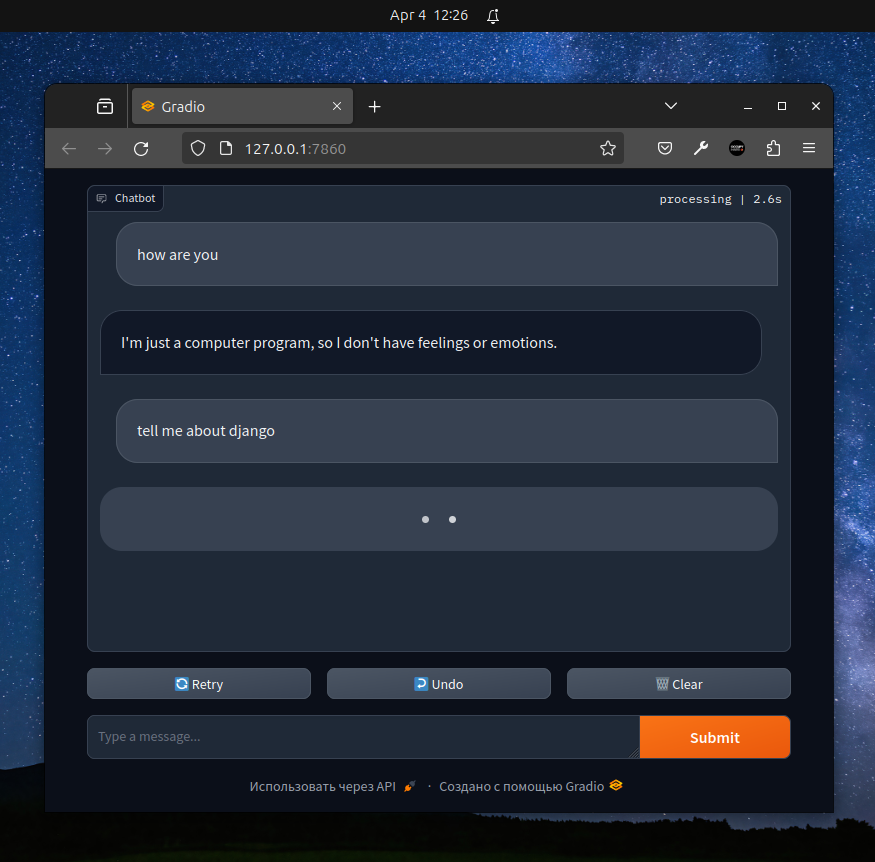

## Start from here

```bash
python3 -m venv venv
```

```bash
source venv/bin/activate
```

```bash
pip install -r requirements.txt
```

```bash
cp .env.example .env
```

```bash
python main.py
```

## Demo



