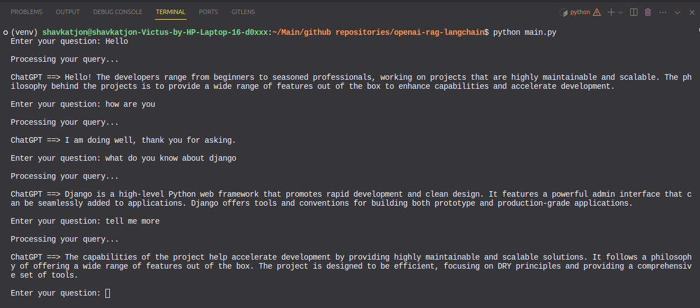

## Demo



## Quickstart

- create virtual environment

```bash
python3 -m venv venv
```
- activate virtual environment

```bash
source venv/bin/activate
```

- install required dependencies

```bash
pip install -r requirements.txt
```

- create .env file

```bash
cp .env.example .env
```

- run program

```bash
python main.py
```
